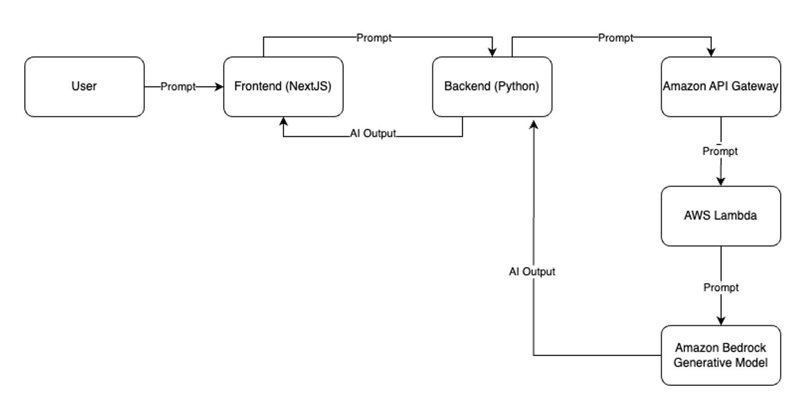

# TypeTalk
TypeTalk is a chat-based AI web application that allows users to interact with 16 MBTI based personalities in order to gain different perspectives on a certain issue

Technologies used: NextJS (Frontend), Python/Flask (Backend), AWS (Bedrock, Lambda), Claude AI

More Information: https://devpost.com/software/cic-hackathon-2024, https://cic.ubc.ca/2024/03/13/looking-back-at-the-ubc-cics-first-hackathon-on-cloud-computing-and-generative-ai/

Built By: Alex Wu, Colin Chen, Dylan Lau, Steven Huang

Architecture Diagram:

